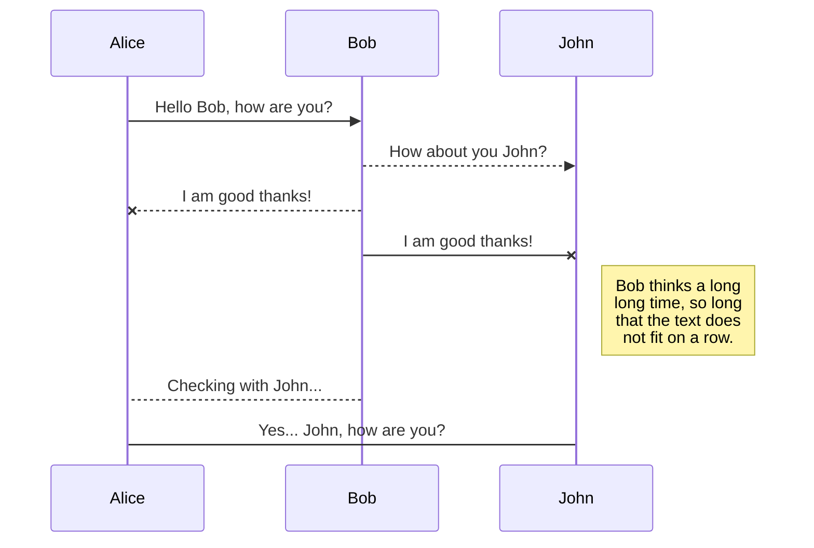




# Neural Text Analysis Pipeline

The following describes some use cases and documentation for the current main functions of the NTAP python package. 

# Some use cases
```
from NTAP.models import RNN, SVM

base_model = LSTM("hate ~ seq(text)", data=data) # text should be column; seq is a keyword for an RNN/CNN model
context_lstm = LSTM("hate ~ text + speaker_party", data=data) # adding column from data (speaker_party); unsupported currently

# base_model.set_params({"hidden"=[200, 50], lr=[0.01, 0.05], batch_size=256, max_epoch=30})
# unfinished: certain params (hidden) require model rebuild, while some params (lr, batch_size, max_epoch) must be moved to the calling train function
# base_model.params_from_file("../params_from_previous_model.json") # unsupported

base_model.CV(data, folds=5)
base_model.CV(data, lr=[.005, .01, .1])
base_model.CV(data, params_path="file.json") # currently unsupported. TODO
params_dictionary = {"learning_rate": [.1, .01]} 
# if iterable is given for variable, grid search automated (only supported for SVM)
base_model.CV(data, params_dictionary) # I think unsupported

print(base_model.best_params)  # type == dict
# not yet implemented (but high priority):
results = base_model.summary(format='pandas')  # 'json'
#   - will print out performance over CVs, if stored; training stats, if stored; params, if stored

# an example of training multiple models: not yet tested
for i in range(10):  # train ten models
	tf.random.seed(i * 123)
	base_model.train(data, model_path="~/saved/{}".format(i))
```
A hypothetical example using TagMe (currently disregard; not high priority)

```
from ntap.data import Tagme
from ntap.models import RNN

data = Dataset("path.csv")
data.tokenize(tokenizer='tweettokenize')
abstracts, categories = data.get_tagme(tagme_token=ntap.tagme_token, p=0.15, tweet=False)
# tagme saved as data object at data.entities
data.background_features(method='pointwise-mi', ...)  # assumes data.tagme is set; creates features
# saves features at data.background

background_mod = RNN("purity ~ seq(words) + background", data=data)
background_mod.CV(kfolds=10)
```

```
from ntap import Dataset
from ntap.models import RNN

gab = Dataset("path/to/gab.csv")
lstm = RNN("hate ~ seq(text)", data=data, hidden=100, rnn_pooling='mean')  # mean pooling of h vectors
attention = RNN("hate ~ seq(text)", data=data, rnn_pooling=100)  # 
attention.set_params(...)
attention.CV(gab)
print(attention.summary(format='pandas', metrics=["f1", "accuracy"])) # TODO

attention.train("hate ~ text", data=gab, seed=100)  # uses best_params; if None: defaults
predictions, variables = attention.predict(data=new_data, fetch_variables="alphas")

from ntap.viz import word_attention
word_attention(variables["alphas"], gab)
```

# Documentation

## `NTAP.Dataset`
Class for managing all data input, text tokenization/cleaning, embedding construction, input/output prep
```
from ntap import Dataset
from ntap.models import SVM
gab_data = Dataset("path/to/data")
gab_data.encode_docs(...)
gab_data.encode_targets(["hate", "fsdlks"], ...)
gab_data.add_features(columns=["fdjsfk"])
saved_model = gab_data.lda("text", num_topics=100)

baseline = SVM("hate ~ lda", data=gab_data)


```
`Dataset(path, tokenizer='wordpunct', vocab_size=5000, embed='glove')`
* constructor calls `load_vocab`

Class methods:
`Dataset.clean(column, remove=['hashtags', 'mentions', 'links'], mode='remove')`
`Dataset.load_embedding(path=None)`
* results in `Dataset.embedding` being saved as a tensor
* if `path` not `None`: try loading embedding from given file. Raise exception `if len(vocab) != len(embedding)`
`Dataset.load_vocab(**kwargs)`
* Re-loads vocabulary with any valid parameters that are specified, e.g. `my_data.load_vocab(embed='word2vec')`
* 

All feature methods (lda, bert, tfidf, ddr, dictionary) can be called from the Dataset object. Then a model call (i.e. `SVM("hate ~ ddr", data=my_data)`) will automatically seek out the member `my_data.ddr` and raise an exception if not there!

```
from ntap.data import Dataset
from ntap.models import RNN
my_data = Dataset("path.pkl")
my_data.tokenize(voc
# model
my_data.tokenize(stopwords=None)
model = RNN("hate ~ words", my_data, rnn_cell='biGRU')
model.CV(folds=10)
model2 = init(...)
for i in range(10):
	model2.train(params=model.best_params, bootstrap=False)
print(model.summary(metrics=['f1', 'accuracy']))
```

## `NTAP.models`

Parent class for all `NTAP` models:
`Model`:
	*	`CV(data, kfolds=10, task="classify")`
		*	Requires that model formula has been specified. Exception raised if formula is incompatible with given DataFrame
		 *	POST: saves dictionary of best parameters in `model.best_params`
		*	POST: saves performance statistics in `model.best_performance`
	*	`params_from_file(path)`
	*	`set_params(**kwargs)`
	*	`train(params)`
		*	Requires that model formula has been specified
		*	`params`: dictionary of training parameters, fed in manually (i.e. from file) or from a CV-trained model's best parameters
		*	
`RNN(formula, data, hidden=128, cell='LSTM', rnn_dropout=0.5, embedding_dropout=None, max_sequence=100, pooling='last', char_embed=None)`
* formula (`str`): indicate model inputs and targets with R-like syntax for specifying `lm`. Some examples:
	* `"hate ~ text"`  (text is column in dataframe)
	* `"hate ~ text + cat(gender)" `(text is column, gender is column)
	* `"hate + moral ~ text"` (multi-task)
* hidden (`int`): size of `RNN` cell (default `128`)
	* Note: Can make default type tuple(int,) `hidden=(128,)` in order to support multiple layers (`hidden=(128, 64)`)
* cell (`str`): type of `RNN` cell (default `'LSTM'`). Options: `LSTM`, `GRU`, `BiLSTM`, `BiGRU`
* `rnn_dropout` (`float`): if not None, adds dropout layer after LSTM layer with value given as keep_ratio (default: `0.5`)
* `embedding_dropout` (`str`): if not None, add embedding dropout of the type indicated in [Adhikari et al., 2019](https://www.aclweb.org/anthology/N19-1408)
* `rnn_pooling` (`str` or `int`):
	* 'last': take the last hidden state of the LSTM and pass to output layer
	* 'mean': mean pooling over hidden states of LSTM
	* 'max': max pooling over hidden states of LSTM
	* type(int): designates the number of hidden units in a self-attention layer
* `char_embed` (str): indicates whether to include character embedding. If not `None`, include 
`MIL(formula, data, ...)`
* requires that `Dataset` has called `mil_tokenize(group_by)`
`HAN(formula, data, ...)`

`CNN(filters=[2,3,4],...)`
* filters (`list[int]`): something about CNN...

`readParams(file, format='dict')`
 * file (`str`): path to parameters. Can be some or all parameters required by model/training. File formats supported: `.json`, `.csv` (two columns,  no header), `.tsv` (two columns, no header)
 * format (`str`): indicate object type to store parameters. Only current option in _v. 0.0.1_ is `dict`

## `NTAP.data`
Functions and Objects supporting the collection of data from within NTAP
`Tagme(token="system", p=0.15, tweet=False)`
* `token` (`str`): Personal `Tagme` token. Users can retrieve token by  [Creating Account](https://sobigdata.d4science.org/home?p_p_id=58&p_p_lifecycle=0&p_p_state=maximized&p_p_mode=view&p_p_col_id=column-1&p_p_col_count=2&saveLastPath=false&_58_struts_action=%2Flogin%2Fcreate_account). Default behavior ("system") assumes `Tagme` token has been set during installation of `NTAP`.
Members:
* get_tags(list-like of strings)
	* Stores `abstracts` and `categories` as member variables 
* reset()
* `abstracts`: dictionary of {`entity_id`: `abstract text ...`}
* `categories`: dictionary of {`entity_id`: `[category1, category2, `}

`TACIT(path_to_tacit_directory, params to create tacit session)`


## UML diagrams

You can render UML diagrams using [Mermaid](https://mermaidjs.github.io/). For example, this will produce a sequence diagram:



And this will produce a flow chart:

```mermaid
graph TD
A[ntap] -- Link text --> B((Models))
B --> D{RNN}
B --> E{CNN}
E --> I[filters<br/>
D --> F[embedding_dropout:<br/>None<br/>TBD <br/>]
D --> G[pooling:<br/>'last'<br/>'mean'<br/>int: attention]
D --> H[cell:<br/>'lstm',<br/>'gru'<br/>'vanilla']
D --> J[bidirectional:<br/>T/F]
D --> 

```
